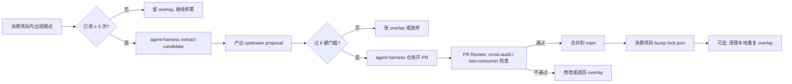

# CONTRIBUTING — 反哺协议

> 如何把消费项目实战积累的模式反哺回 agent-harness 核心。

## 谁可以反哺

任何 agent-harness 的 consumer 项目。当前只有 snapdrill-ios 一个 consumer，未来第二 / 第三 consumer 接入后同理。

## 反哺的硬门槛（必全部满足，除非安全级）

1. **two-consumer rule**（核心）：必须能说明**第二类项目**如何使用这个机制。即使只是假想的玩具场景，也要具体（不能只说"通用就是通用"）。
   - 例外：数据丢失 / 安全级机制允许先 upstream，但 PR body 必须标注"Safety Override"并说明理由

2. **去项目化残余 = 0**：

   ```bash
   grep -riE "snapdrill|swift|ios|swiftui|swiftdata|xcode|<任何消费项目特定术语>" <提议文件>
   ```

   应返回空结果。术语列表按 CI denylist 定义。

3. **通用性可配置**：项目差异必须通过 `project.yaml` / policy config / preset 注入，**不改核心代码**。硬编码 = 拒绝。

4. **可测试**：有 test / fixture / doctor 检查 / 明确的人工验收标准。无测试 = 拒绝（除非是纯文档 / 纯原则，见例外段）。

5. **低污染**：核心不得知道消费项目的具体事实（表名 / 类名 / 命令 / 特定路径）。

6. **生命周期清楚**：知道何时启用、何时退役、如何升级。

## 反哺的次门槛（量化）

**3 迭代周期规则**：同类模式在消费项目内至少**已有效使用 3 次**（或导致过 1 次严重事故级影响），才考虑反哺。

**为什么要 3 次**：一次灵感不足以证明稳定性，3 次以上的重复出现意味着"这是真问题，不是巧合"（三次法则，见 `engineering.md`）。

**例外**：安全 / 数据丢失级 / 明显反模式的修复允许 1 次就 upstream。

## 反哺流程



### 步骤详述

1. **消费项目内积累**：先在项目 overlay 路径（如 `docs/principles/project-*.md` / `.claude/skills/project-*/`）积累，不直接 upstream。

2. **候选识别**：运行 `agent-harness extract-candidate <path>`（Phase E PR-E2 实现）。
   - 工具会做：通用性评分 / 耦合点分析 / 建议去向 / 命中率数据
   - 输出：`agent-harness-proposal-<name>.md`

3. **upstream PR**：在 agent-harness 仓库开 PR，body 必填：
   - **起源**：哪个消费项目 PR 触发的
   - **已有使用**：在消费项目内的使用次数 / 时间窗 / 命中记录
   - **去项目化 diff**：grep 报告 + 改写说明
   - **two-consumer 证据**：第二类项目使用场景（具体）
   - **测试**：新增 / 修改了哪些 test / fixture
   - **迁移说明**：已有 consumer 如何 bump upstream 版本

4. **Review**：
   - 默认走轻量轨道（1 方 cross-audit + 合并）
   - 架构级 / 破坏性改动走完整三方 cross-audit
   - CI 必须全绿（denylist / docaudit self-test / lint）

5. **合并后**：消费项目 bump `.agent-harness/lock.json` 锁定新 commit，可选择清理本地 overlay 中的重复实现。

## 安全级别定义

| 级别 | 例子 | 反哺门槛 |
|---|---|---|
| **S-critical**（数据丢失 / 安全漏洞 / 严重 CI 绕过）| 删错文件的 hook / 绕过 lint 的 alias | 1 次复现即可 upstream + "Safety Override" 标注 |
| **S-normal**（工具 / 方法论 / 质量门禁）| 新 hook / 新 skill / 新 F 规则 | 完整 6 硬门槛 + 3 次迭代周期 |
| **S-experimental**（实验性模式，前景不明）| 尝试中的 prompt 技巧 / 临时 workaround | 留 overlay，**不反哺**，直到升级为 normal 级 |

## 防污染保障

1. **PR 模板**强制填 "Project-specific residue removed" 字段，内容空 = 拒绝
2. **CI denylist**：核心目录 (`core/` / `adapter-*/`) 禁止出现消费项目术语
3. **preset 分层**：消费项目的 preset (`preset-ios/` / 未来 `preset-web/` 等) 里允许项目相关术语，但 `core/` 不允许
4. **`docaudit` 自我扫描**：agent-harness 仓库自己跑一份 docaudit，检查自己的文档是否符合原则

## 谁是 reviewer

当前（Phase D 阶段）：

- **Primary**：仓库 owner（用户）
- **Secondary**：三方 cross-audit（Claude 主线程 / Codex / Gemini）按 consensus 流程

未来如果 agent-harness 开源：

- 新增 maintainer 角色
- Review 规则在 `docs/governance/` 定义

## 当前 Phase D 特殊情况

Phase D 还在**建仓 + 骨架迁入**阶段，反哺协议本身还在起草。在 Phase E PR-E1 完成之前，反哺流程按**本文件草案 + 人工判断**混合执行。PR-E1 会把本文件升级为完整 contribution rubric（含自动化检查）。

---

**三方 cross-audit consensus 来源**：

- Codex 独有："two-consumer rule" + 6 维硬门槛
- Gemini 独有："3 迭代周期"次门槛
- Claude 独有："去项目化 grep" 残余测试
- 全部三方采纳，形成本协议
